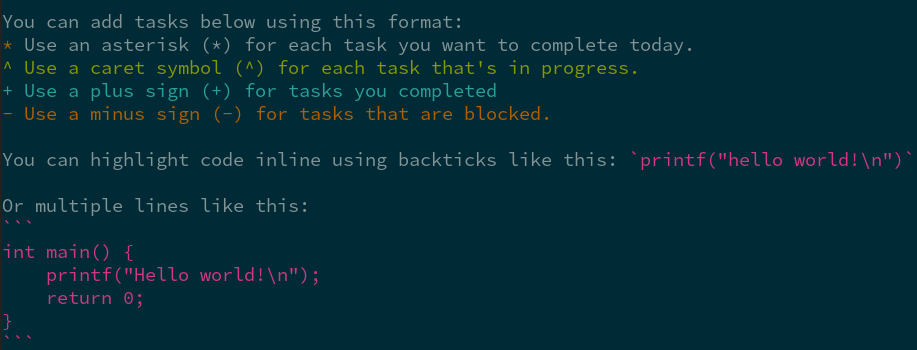

# devlog-vim
Vim syntax plugin for devlog.

## About

Devlog is a command-line tool for tracking your day-to-day software development work.  You can find more information at [devlog-cli.org](https://devlog-cli.org).

This plugin provides syntax highlighting for devlog files in vim.  It looks like this:




## Install

The plugin can be installed as a [Vim8 package](https://vimhelp.org/repeat.txt.html#packages):

```
git clone https://github.com/wedaly/devlog-vim ~/.vim/pack/plugins/start/devlog-vim
```
